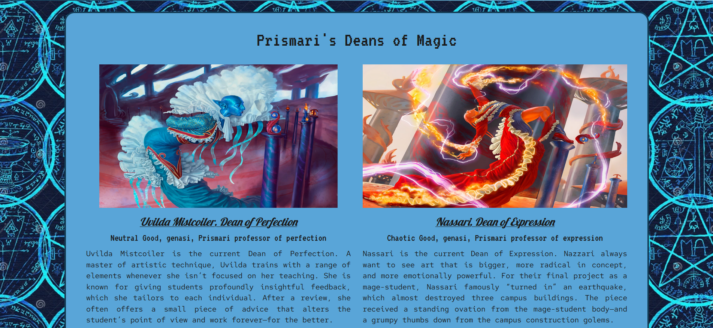

# Tyler 2.0

## DESCRIPTION 

Week 20 Challenge for Full-Stack Programming bootcamp at the University of Washington in partnership with edX. This is my second go at a portfolio! I used react, bootstrap and my own css styling to show off my works and let potential employers know more about me. 

[Repository](https://github.com/tykervella/tyler-two-point-oh)

[Deployed Link](https://tylerkervella.com)

---

## TABLE OF CONTENTS 

[Description](#description)

[Installation](#installation)

[Usage](#usage)

[Contributions](#contributions)

[Testing](#testing)

[License](#license) 

[Questions](#questions)

---

## INSTALLATION 

This project is meant to be viewed at the deployment link included within this README. No installation required!

---

## USAGE

This runs in the browser at the deployed link! 

You start by viewing the <b>About</b> page to learn a bit more about me. You can then navigate to Portfolio, Resume or Contact from the Nav element in the top right corner of the page. 

Clicking <b>Portfolio</b> will display my five most recent projects, with a featured project highlighted at the top of the page. Each project contains a title, description and can be clicked to navigate to that project's corresponding github repository. 

Clicking <b>Resume</b> will allow the viewer to click on an embedded link and download my resume. It also showcases badges of the top 12 marketable skills I have to offer for easy viewing.

Finally, clicking on <b>Contact</b> will render a form that allows the user to enter their name, email and a brief message. This form does not currently work. 

At the bottom of the page, links to my linked in, github and my phone number are displayed 

---

## CONTRIBUTIONS

The  file structure and some logic for the NavTabs and PortfolioContainer files were referenced from Week 20, activity 24 from the coding bootcamp I attended. 

---

## TESTING

N/A

---

## LICENSE 

MIT License
      Copyright (c) 2023 tykervella
      
      Permission is hereby granted, free of charge, to any person obtaining a copy
      of this software and associated documentation files (the "Software"), to deal
      in the Software without restriction, including without limitation the rights
      to use, copy, modify, merge, publish, distribute, sublicense, and/or sell
      copies of the Software, and to permit persons to whom the Software is
      furnished to do so, subject to the following conditions:
      
      The above copyright notice and this permission notice shall be included in all
      copies or substantial portions of the Software.
      
      THE SOFTWARE IS PROVIDED "AS IS", WITHOUT WARRANTY OF ANY KIND, EXPRESS OR
      IMPLIED, INCLUDING BUT NOT LIMITED TO THE WARRANTIES OF MERCHANTABILITY,
      FITNESS FOR A PARTICULAR PURPOSE AND NONINFRINGEMENT. IN NO EVENT SHALL THE
      AUTHORS OR COPYRIGHT HOLDERS BE LIABLE FOR ANY CLAIM, DAMAGES OR OTHER
      LIABILITY, WHETHER IN AN ACTION OF CONTRACT, TORT OR OTHERWISE, ARISING FROM,
      OUT OF OR IN CONNECTION WITH THE SOFTWARE OR THE USE OR OTHER DEALINGS IN THE
      SOFTWARE.
   

--- 

## QUESTIONS

Any Questions regarding this project can be directed to me personally. You can find me at [github](https://github.com/tykervella) or send me an email at tylerkervella@gmail.com.