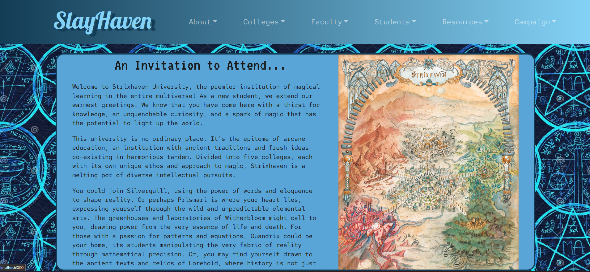

# SlayHaven: A Curriculm of Yas Gawd!

## DESCRIPTION 

Single Page react site created as an information hub for my new dnd campaign. This project utilizes react and react-bootstrap to create a mobile-first front-end that is organized to quickly and easily allow users to find the information. The campaign setting is based off of the Strixhaven: Curriculum of Chaos module, with elements of my own homebrew added to flush out the setting!

[Repository](#)

[Deployed Link](#)

---

## TABLE OF CONTENTS 

[Description](#description)

[Installation](#installation)

[Usage](#usage)

[Contributions](#contributions)

[Testing](#testing)

[License](#license) 

[Questions](#questions)

---

## INSTALLATION 

This project is meant to be viewed at the deployment link included within this README. No installation required!

---

## USAGE

This runs in the browser at the deployed link! 

At the Home page, you are shown an Invitation to Attend, which is meant to be read like a letter that a prospective student would recieve. 

You navigate through the <b>About</b>, <b>Colleges</b>, <b>Faculty</b>, <b>Students</b>, <b>Resources</b>, and <b>Campaign</b> tabs to view the appropriate information. 

At the bottom of the page, links to my linked in, github and my phone number are displayed 

---

## CONTRIBUTIONS

N/A

---

## TESTING

N/A

---

## LICENSE 

MIT License
      Copyright (c) 2023 tykervella
      
      Permission is hereby granted, free of charge, to any person obtaining a copy
      of this software and associated documentation files (the "Software"), to deal
      in the Software without restriction, including without limitation the rights
      to use, copy, modify, merge, publish, distribute, sublicense, and/or sell
      copies of the Software, and to permit persons to whom the Software is
      furnished to do so, subject to the following conditions:
      
      The above copyright notice and this permission notice shall be included in all
      copies or substantial portions of the Software.
      
      THE SOFTWARE IS PROVIDED "AS IS", WITHOUT WARRANTY OF ANY KIND, EXPRESS OR
      IMPLIED, INCLUDING BUT NOT LIMITED TO THE WARRANTIES OF MERCHANTABILITY,
      FITNESS FOR A PARTICULAR PURPOSE AND NONINFRINGEMENT. IN NO EVENT SHALL THE
      AUTHORS OR COPYRIGHT HOLDERS BE LIABLE FOR ANY CLAIM, DAMAGES OR OTHER
      LIABILITY, WHETHER IN AN ACTION OF CONTRACT, TORT OR OTHERWISE, ARISING FROM,
      OUT OF OR IN CONNECTION WITH THE SOFTWARE OR THE USE OR OTHER DEALINGS IN THE
      SOFTWARE.
   

--- 

## QUESTIONS

Any Questions regarding this project can be directed to me personally. You can find me at [github](https://github.com/tykervella) or send me an email at tylerkervella@gmail.com.